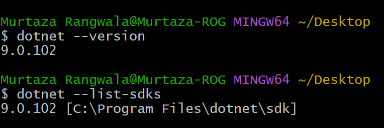
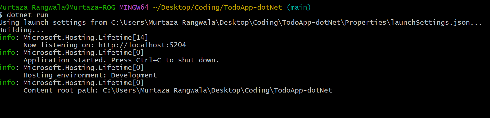
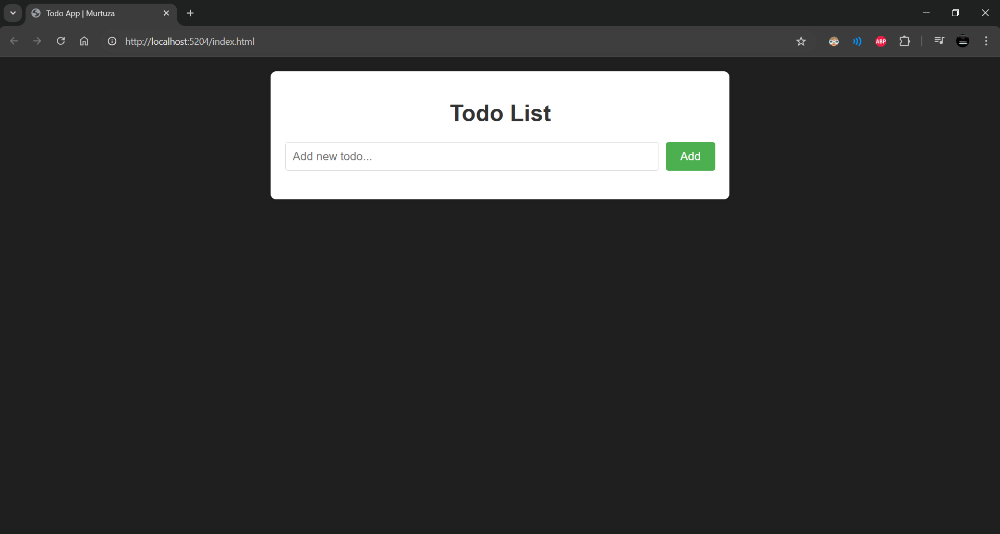

# Basic To-do app with DotNet

## Why you here ??

- Ohh you find this project, okay then let's try it.

### Wait do you know how to run it ? Or should i teach you ?

- I see, you are still here, hmmm, you wanted to learn how to run dotNet project.

## Let's get started then...

- Here i use `<TargetFramework>net9.0</TargetFramework>` dotnet sdk version 9 here.

- Check if you have dotNet sdk 9 installed locally.

  - If you don't know about how to do that then just google it Or use ChatGPT(still in 2025 i have to tell you this, Weirdo!!)
  - You still don't trust me right, hmmm i smell that. See it below you noooob.

    

- Clone this project and open your terminal, for mac and linux guys you got it what is terminal, for windows guys terminal means cmd or powershell, but it's not recommended to use both, Use `git bash` if you don't have one installed it, it will be useful for you i promise.

  `git clone https://github.com/murtazarangwala99/ToDo-dotNet.git`

## How we can run this ?? Good question.

- Change your directory using `cd ToDo-dotNet` you will be inside the project.
- Now run `dotnet run` (First time, It will take some times, so be patient my student)

- No need to understand command and as of now just chill and enjoy todo app, wait wait you only see some weird lines in terminal how to open it in browser.
- Hmm, Sabr(Be patient)

## Running it inside browser

- You can see something like this in terminal `Now listening on: http://localhost:5204` click on that url and you get your project up and running

  

- Or you can copy it from here `http://localhost:5204`

- OR Just click here buddy [TODO IS RUNNING](http://localhost:5204/index.html)

- Wallahh You have successfully completed a Mission to run dotNet app.

- You get output something like this

  

---

## Thank you 😇 and enjoy your Day 😉
